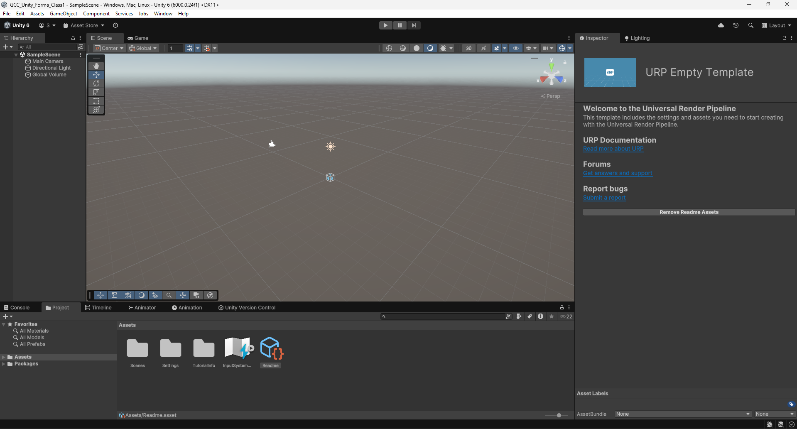

# Class 1

In this first class, you'll learn the following:
- use the game engine for basic tasks (moving the camera, creating and modifying assets, etc)
- create an object
- add components to an object
- modify properties of an object / its components
- retrieve user inputs
- understand basic principles of the physics system (colliders, rigidbodies)

## Creating a new project

Make sure you have the Unity version 6000.0.24f1 or later (earlier versions might use deprecated systems, but you should still be able to follow the class since it covers some general knowledge of the game engine).

Click on `new_project` and select the `Universal 3D` Template. You can set your project name and folder on the right. Once you're done setting up, click on `Create project`. The unity editor should start loading a new project.

  

## Navigating the editor

You should have spawned inside the editor, and your screen should look something like this:

There are a few different windows. 

*(MMB = Middle Mouse Button, RMB = Right Mouse Button, etc)*
- In the center, the `scene` window. This is the place where you'll edit your game levels and ui. 
Use **MMB** to pan the view and **Shift + RMB** to rotate the view.
**Scroll** to zoom in and out, and use **Alt + LMB** to rotate around a virtual point in space.
- 