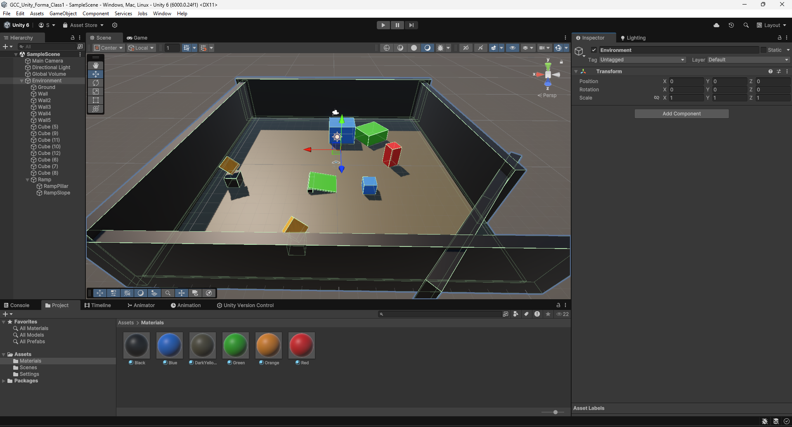

# Class 1

In this first class, you'll learn the following:
- use the game engine for basic tasks (moving the camera, creating and modifying assets, etc)
- create an object
- add components to an object
- modify properties of an object / its components
- retrieve user inputs
- understand basic principles of the physics system (colliders, rigidbodies)

## Creating a new project

Make sure you have the Unity version 6000.0.24f1 or later (earlier versions might use deprecated systems, but you should still be able to follow the class since it covers some general knowledge of the game engine).

Click on `new_project` and select the `Universal 3D` Template. You can set your project name and folder on the right. Once you're done setting up, click on `Create project`. The unity editor should start loading a new project.

  

## Navigating the editor

You should have spawned inside the editor, and your screen should look something like this:

There are a few different windows. 

*(MMB = Middle Mouse Button, RMB = Right Mouse Button, etc)*
- In the center, the `Scene` window. This is the place where you'll edit your game levels and ui. 
Use **MMB** to pan the view, **Shift + RMB** to rotate the view and **Scroll** to zoom in and out.

Now that you know how to move around in the scene, let's add an object to it. 
Go to the `GameObject` menu on the top of the editor, and under `3D Object`, click on `Cube`.

- On the left is the `Hierarchy`. If you haven't clicked anything after creating your cube, you should see that you can rename it as you want. 
The window represents the scene tree, where you'll find all the objects in the current scene. 
Make sure your cube is selected in the hierarchy (it should be highlighted in grey or blue).

You can press **F** while your cursor is over the Scene window to focus the currently selected object. 
This is extremely useful if you want to navigate directly to a specific object in your scene.
Use **Alt + LMB** to rotate around the currently focused object.

If you have multiple objects on top of each other, using **Ctrl+RMB** lets you choose which object you want to select without having to spam click until you have the right one.

- The tab `Game` next to `Scene` is where you'll be able to playtest your game. 
- At the bottom is the `Project` window. There, you'll find all your files and assets for this project. They can be found on your computer at `/path_to_project/Assets`.
It's best to keep it organized in different folders as the further in size your project grows, the harder it will be to find your files if not organized.
- You can find a few different tabs along the `Project` one, such as `Console` or `Animation`. `Console` will be where errors/warnings are reported, and where you'll be able to print debug states.
- On the right is the `Inspector`. In this window, you will be able to edit the properties of your objects. 

If your cube is still selected, you should see a bunch of different options such as `Transform`, `Mesh Rendered` or `Box Collider`.
These are the components/scripts attached to your object. By default, all GameObjects come with a Transform. 
It's the component handling the position, rotation and scale of your object in the scene. 
You can try changing the values and the cube should react accordingly
(you can also click and drag on the variable names (`x`, `y`...) to change the value).
Likewise, moving the object with the arrows handle on the scene window will change the value in the inspector.

We will now test our super game! To enter play mode, you can press the play button at the top center (or hit **Ctrl+P**). 
You should automatically be switched to the Game window. If you haven't moved your cube too far out, it should appear on the screen. 
What we currently see is the point of view of the camera object. You can select it in the hierachy and move it. 
You can also add other objects by right-clicking in the hierarchy.

Now exit play mode (the stop button or **Ctrl+P**, not the pause one which lets you skip frame by frame, often used for debug).
Oh no! The second cube has disappeared, along with the modifications we made to the camera. Did we forget to save something? 
Actually, no. Even if we had tried to save our project, it wouldn't have worked. 
When you are in play mode, all changes that you make to the scene won't be saved. 
It is useful to test things without destroying the scene you just spent hours creating. 
However, remember to exit playmode before making permanent changes.

## Creating a simple scene

### Basic shapes

Now that you know how to get around the editor a little, let's have a little fun by creating a small scene. 
I'll only use cubes, but you can try the other primitives too (cylinder, sphere, etc). 
The shortcut **Ctrl+D** lets you duplicate the currently selected object.
Don't forget to rename your objects to keep your scene hierarchy tidy.
By rotating, moving and scaling the objects, you can easily get sometehing that looks like this:

### Colors
Although, even if the scene looks better now, it's still missing something to make it interesting.
So, how do we add colors? By creating what's called `Materials`. 
They are assets that define the looks of an object (colors, textures, shaders...), 
and they can be assigned to a `Renderer` component for the engine to use them. 
If you look at the inspector of any of your cubes, you should see a `MeshRenderer` component.
It has a field named `Materials` where you can assign multiple materials (though we'll only use one for each object).

To create a new material, we will go to our Project window at the bottom. 
First, we will create a new folder (Right-click, Create -> Folder) inside the Assets folder and name it *Materials*.
Then, the same way, we will create a Material in it and name it *Black*
(or *MaterialBlack*, or any other name that will help you know what it represents).
You should see it appear along with new inspector options on the right.

For now, we will only be interestede in one setting, `Base Map` under `Surface Inputs`. 
You can then click on the white bar (the color slot) and choose the color of your material (black here).
Once that's done, you can drag and drop your material to any object on your scene and it should automatically apply itself to the renderer
(you can check by yourself, though the apparent color should be a great indicator).

With this, try and make your scene a little more colorful. Mine looks like this:

### Prefabs
Let's say you made a cool structure, and you want to reuse it. 
Do you have to select all the items that make it, then duplicate them and move them in place?
Quite tedious, and not very scalable. But of course, there's a solution for that. 
First, lets make a small ramp with two cubes. We will also create an empty object and call it *Ramp*. 
Then, we drag and drop (in the hierarchy) the two cubes that make up our ramp to the empty *Ramp* object to make them childs of it.

That way, we can already duplicate our ramp more easily by only selecting the parent object. 
It is also a way to organize and tidy our hierarchy. I will do something similar with our objects by making an empty *Environment*
that will contain all of the environment props. And just before adding any children to it, I'll make sure its transform 
is reset to default values to avoid strange problems later down the line 
(you can do so by Right-clicking on the Transform component and selecting `reset`).

But our work here is not done. You might want to reuse this structure in another scene (we'll have a look at scene in another class), 
or even be able to make one change and have it applied to all instances of your structure, like a different color.
For that, we are going to use `Prefabs`. Prefabs are assets (meaning they are stored in your project files, not in the scene)
and can be reused from anywhere in your project or even your friend's.
To create a prefab, simply drag and drop the object you want to make a prefab of to your `Project` window. 
It should now appear blue in the hierarchy. 
Don't forget to keep your project tidy by placing your assets in corresponding folders.

You can now simply drag and drop your prefab from your project files to the scene (or the hierarchy) and it will be added.
You might notice some offset between your cursor and the prefab while dragging it, or the ramp floating in the air when you drop it.
That is because the ramp object itself has a default position that is not zero, and the object that compose it are not centered around
the empty object. To fix that, we will enter `Prefab mode` by double clicking on the prefab 
(or clicking the little arrow left of the instanciated prefab in the hierarchy to see it in context mode).

We can start by resetting the transform of the prefab 
(if you can't, that's because you are in context mode and some settings can't be changed there, try opening from the project window).
The ramp should disappear from the view. That's because the position of a child is relative to that of its parent.
So we now have to move the children back to the center of the object.
To facilitate the task, you can add a plane or any other primitive and set its position to zero so you have a visual cue.
Once you're done, don't forget to save your prefab, 
and you might have to move your ramp back on the scene as the changes we made to the prefab were also applied to the instances.

### Physics

Finally, we will add a sphere juste above the ramp so it will roll down and position our camera. 
An easy way to setup the camera is to move the view where you want, an then select the camera, go to `GameObject` and `Align With View`.

Now hit play and...
Well, that's a bummer. The sphere didn't roll down as we expected.

That is because we haven't told the engine that we wanted to simulate our object, so it doesn't do anything. 
And if we were to simulate all objects, it would make it way too slow and often unrealistic 
as static objects would sometimes move due to small errors.
However, by default each primitive comes with its own collider, which will define where the object will collide with simulated objects.

To simulate the sphere, simply go to its inspector and click on `Add Component` at the bottom. 
You can then type `Rigidbody` and select the corresponding component (not the 2D one).
Hit play again, and this time it works! Yay!

## Adding a player

It's time for us to actually play, and not just watch as the game runs! 

And for that, we'll be adding a player that will move around the scene. 
When making a player for a 3D game, there are generally only two options to choose from:
- either you make a First Person Controller, meaning you'll see from the eyes of your character 
(shooter games often use this, like in Call of Duty or Overwatch)
- or you make a Third Person Controller, where the camera will be behind the player (like in The Last of Us, Uncharted, 
or many other adventure games)

For the sake of simplicity, we'll stick to first person in this course. 

In unity, there are three main ways to make a character controller. 
- The first one is by coding everything from scratch, meaning you'll have to use your own physics system. 
This can be pretty inneficient and overcomplicate things, but depending on your game it could be an option. 
However, bear in mind that this is an option you should choose only if you ave a very deep understanding of physics in a game engine.
- The second one is using a `Rigidbody` as a base. This will allow the physics engine to take care of all physics related stuff,
and you'll be able to simulate the forces that are applied to your player like the wind, 
how slippery the floor is and many other more easily. It is however a bit hard to set up/code at a beginner level, 
and also means that you won't really have extremely precise control over the movement easily as it will be handled by the engine.
- The third option is using the provided `CharacterController` component. 
This component takes care of almost all of the basic code you might need, such as collisions, stairs and slopes.
However, it is not simulated by the physics engine, so you'll have to code your own gravity and physics interactions 
like pushing an object around. Though this also means that you have complete control over the movement of your player 
(except for collisions where it's always a bit tricky to code custom interactions, but is almost never needed). 
Another downside is that you won't be able to use any shape for the collisions other than the capsule one (which is often enough).

For this course, we'll use the CharacterController along with a custom player prefab available [here](ClassTutorialAssets/FPSController_IS.unitypackage).
Just drag and drop the file in your Project window, and click import.

Once the import is complete, you should have a new prefab in your Prefab folder, called `Player`. 
Drag and drop the player in the scene (adjust the position if needed) and test the scene. 
You should be able to move the player using **WASD/ZQSD/Arrows** keys, but the camera is not inside it.
The problem is that we did not remove the previous camera, so there are currently two cameras trying to render the scene.
One we placed before, and one inside the player. Remove the previous camera (by pressing **Del** or right-clicking in the hierarchy)
and try running the game again. 

If you had not forgotten to quit play mode before making your changes, 
you should now see from the player's perspective and be able to move the camera using your mouse. You can also jump with **Space**
and sprint while pressing **Shift**.

Before we end this class, let's take a quick look at how the player is built.
To isolate it from the rest of the scene, lets go into prefab view.

First, lets take a look at the hierarchy:

We have 
- a player object as the root, which will contain the scripts and components for the movement;
- the camera;
- a capsule which is the visual part of the player (you can see that the collider was removed);
- and an empty object that will help our script determine where the ground is.

Now, lets look at the inspector of the root object, the player:

First off, we have the `Transform`, nothing new here.

Then, we have the famous `CharacterController` component. 
We can see a bunch of options like slope limit or the step offset which are pretty self-explanatory.
The center, radius and height ones are for defining the collider (a capsule) used by the component.

Next up is the `MouseLook` script. If you want to take a look at how its written, 
double-clicking the script field will open it in your designated editor. 
The inspector shows values for the sensitivity or smoothing of the camera, 
and asks for a reference to the camera that will be used.

In fourth comes the `PlayerMovement` script. 
You can have fun changing the values and testing how it affects the movement 
(here, changing the values in play mode will be useful as you'll come back to the previous ones 
when you exit it).
Below the movement are the options used to check if the player is grounded. 
This is needed for allowing the player to jump only when touching the ground.

Finally, the `PlayerInput` component. This is the bridge between the scripts and the user inputs.
If you open the Events and Player dropdowns, you'll see many different slots for the different actions
that the user can input, such as Move, Look, or Jump.

For some of these actions, a specific function from the PlayerMovement or MouseLook scripts is assigned.
This means that when the user will perform said action, the corresponding functions will be called.

These actions are defined in an asset available in your Assets folder called *InputSystem_Actions*.
You can go take a look at how it's build, and even add some actions of your own.

## Conclusion

And that's it for this class! Thank you for following up to here, and see you next time.
Don't forget to experiment with what you've learned here, as you'll only get better through practice.
For example, you could make a level where we have to jump from box to box in order to get to a very high or far point.

Bye!

*course by Julien Charvet for GCC*